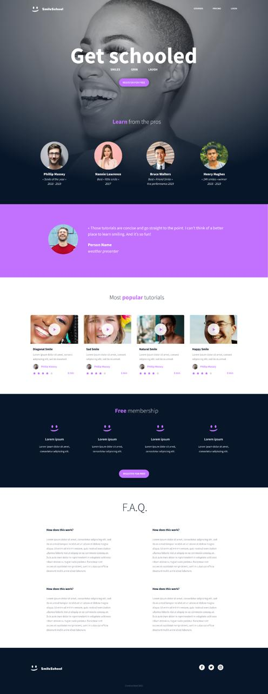

# SmileSchool Landing Page



## 📘 Project Overview

SmileSchool is a fictional landing page that promotes a fun and engaging platform where users can learn how to smile through video tutorials. It includes expert testimonials, a gallery of popular tutorials, a free membership section, FAQs, and more — all wrapped in a clean, modern layout.

## 🚀 Features

- ✅ Hero section with bold heading, subheadline, and call-to-action
- ✅ Navigation links (Courses, Pricing, Login)
- ✅ Expert testimonials with profile photos and accolades
- ✅ Featured quote with colored background
- ✅ Grid layout of popular video tutorials with play icons, ratings, and duration
- ✅ Free membership benefits section with icons
- ✅ Frequently Asked Questions (FAQ)
- ✅ Footer with logo, copyright, and social media

## 📁 Folder Structure

```

SmileSchool/
├── index.html
├── style.css
├── Homepage.jpeg
├── images/
│   ├── expert1.jpg
│   ├── tutorial1.jpg
│   └── ...
└── README.md

```

## 🛠 Technologies Used

- HTML5 (semantic structure)
- CSS3 (Flexbox layout, visual styling)
- No frameworks or libraries (vanilla CSS and HTML)

## 🧰 Setup Instructions

1. **Clone or download** this repository to your local machine.
2. Ensure all files are in place, including `Homepage.jpeg` at the root.
3. Open `index.html` with any modern browser.
4. Done! You’ll see the full SmileSchool landing page as designed.

## 📌 Future Improvements

- Make the site responsive for mobile and tablet devices.
- Add interactive behavior to the FAQ section using JavaScript.
- Use real images, icons, and content instead of placeholders.
- Optimize assets for performance and accessibility.
```